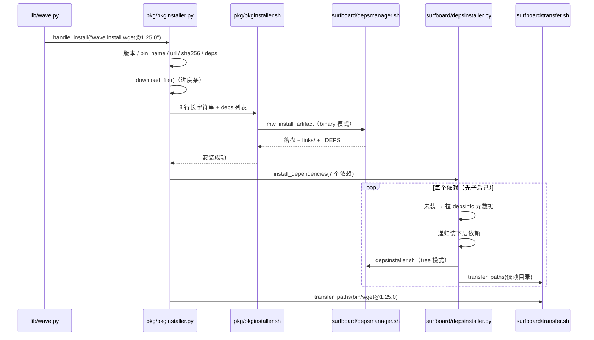

# 🌊 MacWave 项目结构

面向 macOS / Linux 软件开发者的包管理器，主要托管 iOS/iPadOS 相关软件包。
技术栈：Python + Shell。

- `2.2.0` 等版本分支：程序代码
- `infosource` 分支：纯数据（包与依赖的元数据、下载地址、校验值）

---

## 一、仓库目录

```
lib/          入口与帮助
pkg/          安装与查询核心
surfboard/    依赖处理
scripts/      回归测试脚本
.github/      CI
.templates/   目录与文件的模板样例（bin/、pkg/、macwave_config/）
.Pseudocode/  早期伪代码，仅作参考
STYLE.md      代码风格约定
README.md     用户文档
```

## 二、各文件作用

### lib/ —— 入口与帮助

| 文件 | 作用 |
| --- | --- |
| `wave.py` | 主入口。读 `/opt/macwave_config/config.json` 的 `base_dir`，把 `lib/`、`pkg/`、`surfboard/` 注入 `sys.path`；用 `COMMANDS` 字典把 `install / uninstall / list / search / info / version` 分发到对应模块，`ARGUMENTS` 处理 `-h/--help/-V/--version` |
| `help.py` | 帮助与版本文本：`print_custom_help`（简短用法）、`print_detailed_help`（详细命令）、`print_version`、`print_error_help` |
| `install.sh` | 官方安装脚本：选安装目录、`sudo` 提权、写 `config.json` / `VERSION.json`、把 `lib/`、`pkg/`、`surfboard/` 下的程序文件全部拉下来、安装 Python 依赖（requests / packaging / rich）、把 `bin/` + `links/` + `lib/` 写入 PATH、许可协议确认 |
| `uninstall.sh` | 卸载 MacWave 本体：读配置定位 `BASE_DIR`（失败则遍历候选路径）、二次确认后删除安装目录与配置目录、清掉 rc 文件里的 PATH 行、最后自删 |

### pkg/ —— 安装与查询核心

| 文件 | 作用 |
| --- | --- |
| `pkginstaller.py` | **软件包安装编排**。解析参数与架构 → 定版本（`@版本`、`--ver` 或远程取最高）→ 拉 `_包名@common` 取 `bin_name` → 拉版本文件取 `url` / `sha256` / `deps` → 下载（rich 进度条、断点续传、限速、代理、30 秒超时+重试询问）→ 调 `pkginstaller.sh` → 通过 `depsinstaller` 递归安装依赖 |
| `pkginstaller.sh` | **软件包安装入口（binary 模式）**：组装长字符串，调用通用安装核心 `depsmanager.sh` 的 `mw_install_artifact`，写 `installed.json`，输出安装结果 |
| `pkginfohelper.py` | `list`（扫描 `bin/` 下的目录）、`search`（远程匹配包名）、`info`（本地已装版本 + 远程可装版本 + `@common` 描述） |
| `pkgversionparser.py` | 版本号比较与排序；处理 `alpha/beta/rc` 预发布，以及 `procursus` / `macwaveteam` / `Xteam` 等特殊版本 |
| `pkgunzip.sh` | 按扩展名解压：`zip` / `tar.gz` / `tar.bz2` / `tar.xz` / `tar` / `gz` / `bz2` |
| `uninstaller.py` | **卸载**：扫描 `bin/` 找出该包所有版本；删除包目录与软链接；按 `_DEPS` 删除依赖标记，若某依赖已无任何标记，则连同它自己的依赖一起级联删除 |

### surfboard/ —— 依赖处理（2.2 新增）

| 文件 | 作用 |
| --- | --- |
| `depsinstaller.py` | **依赖安装编排（Python）**。校验/解析依赖引用 → 拉 `_依赖名@common` 取 `dep_name` → 拉 `_依赖名@版本号` 取 `url` / `sha256` / `deps` → 复用 `pkginstaller.download_file` 下载（进度条与软件包一致）→ 调 `depsinstaller.sh` → 递归安装子依赖；依赖已安装时只补标记（走 `tagger.sh` 命令行） |
| `depsinstaller.sh` | **依赖安装入口（tree 模式）**：`source depsmanager.sh` → 调 `mw_install_artifact` → 在依赖目录里创建 `.depped_pkg_*` / `.depped_dep_*` 标记 |
| `depsmanager.sh` | **通用安装核心**（被 `pkginstaller.sh` 与 `depsinstaller.sh` source，不单独执行）：定位下载到的原文件、SHA256 校验、解压、落盘（`binary` / `tree` 两种形态）、创建 `links/` 软链接、写 `_DEPS`、标记文件辅助函数 |
| `tagger.sh` | `.depped_*` 标记文件原语：`tagger_create` / `tagger_delete` / `tagger_has_any`，既可 `bash tagger.sh <动作> …` 调用，也可被 source |
| `transfer.sh` | **路径替换（Homebrew 式）**：把产物里所有 Mach-O 的动态库引用（`LC_LOAD_DYLIB`）与自身 `install name`（`LC_ID_DYLIB`）改写成 `BASE_DIR` 下的绝对路径，运行时 dyld 才找得到依赖；改过的文件自动做 ad-hoc 重签名（Apple Silicon 必需）。解析顺序：产物自己的 `lib/` → `_DEPS` 列出的依赖 → 其它已安装依赖的 `lib` |
| `depsversionparser.py` | 依赖引用解析（强制 `依赖名@版本号`）与版本比较；版本逻辑复用 `pkgversionparser.py` |
| `querier.py` | 查询依赖是否已安装：`deps/{引用名}/{引用名}@{版本号}/` 存在**且含 `_DEPS`** 才算安装完成（避免中途失败留下的空目录被误判） |

### scripts/ 与 CI

| 文件 | 作用 |
| --- | --- |
| `scripts/format_test.sh` | 8 种打包格式（无扩展名 / zip / tar.gz / tar.bz2 / tar.xz / tar / gz / bz2）逐个跑 install → 运行 → uninstall |
| `.github/workflows/format-test.yml` | 在 `macos-latest` 上把 `lib/`、`pkg/`、`surfboard/` 部署到 `/tmp/macwave-test`，再运行上面的脚本 |

## 三、安装后的运行时目录

`BASE_DIR` 取自 `/opt/macwave_config/config.json` 的 `base_dir`（默认 `~/.local/macwave`）。

```
BASE_DIR/bin/{可执行文件名}@{版本}/            软件包：二进制 + _DEPS
BASE_DIR/deps/{引用名}/{引用名}@{版本}/        依赖：整棵解压目录 + _DEPS + .depped_* 标记
BASE_DIR/links/{名字}@{版本}                   软链接，此目录已加入 PATH
BASE_DIR/pkg/installed.json                   已安装软件包记录
BASE_DIR/downloads/tmp/                       下载临时目录（*.partial 表示未下载完）
BASE_DIR/{lib,pkg,surfboard}/                 程序文件自身
/opt/macwave_config/config.json               base_dir
/opt/macwave_config/VERSION.json              版本信息
```

## 四、数据源（`infosource` 分支）

软件包：

```
pkg/pkginfo_{arch}/{包名}/_{包名}@common     bin_name / des / hom / lic / aut
pkg/pkginfo_{arch}/{包名}/_{包名}@{版本号}    url / sha256 / deps
```

依赖：

```
surfboard/depsinfo_{arch}/{依赖名}/_{依赖名}@common     dep_name / des / hom / lic / aut
surfboard/depsinfo_{arch}/{依赖名}/_{依赖名}@{版本号}     url / sha256 / deps
```

- `{arch}` 为 `arm64` 或 `amd64`
- 下载地址强制 `https://`
- **`deps` 写在版本文件里**（不是 `@common`），每行一个 `依赖名@版本号`，多行书写：

```
deps: "gettext@0.21.0"
      "openssl@3.0.15"
      "zlib@1.2.13"
```

- 简易 DSL 解析规则：行内第一个引号**前**有 `字段:` 声明，该行属于该字段；否则向上回溯到最近的字段声明；同一字段多行合并为列表。`deps` 字段缺失即视为无依赖
- 依赖引用格式强制 `依赖名@版本号`，不合规直接报错退出
- 依赖名/版本在 `depsinfo_{arch}/` 里找不到时报错退出

## 五、关键机制

1. **目录 + 软链接**：包与依赖都不再以“单个文件”形式存在，而是目录；`links/` 里放软链接并已加入 PATH。用户必须输入 `名字@版本号`，不带版本号一律 `command not found`
2. **两种安装形态**（共用 `depsmanager.sh` 的同一套流程）：
   - `binary`（软件包）：解压后只取一个可执行文件，同名优先，找不到同名则取第一个并打 YELLOW 警告
   - `tree`（依赖）：保留整棵解压目录（库包不能只取一个文件）；`bin/` 下的每个文件都软链到 `links/{名字}@{版本号}`，因此不依赖“与包同名的可执行文件”
3. **`_DEPS`**：安装后写入，每行形如 `"a@1.0"`；卸载时据此清理依赖
4. **`.depped_*` 标记**：记录“谁依赖了我”
   - `.depped_pkg_{包名}@{版本号}`：被某个软件包依赖
   - `.depped_dep_{依赖名}@{版本号}`：被某个依赖依赖
   - 卸载时先删掉自己的标记；某依赖已无任何标记，才连同它自己的依赖一起级联删除，多个依赖者共享时不会被误删
5. **递归**：依赖自身的 `deps` 会被继续安装（先装下层、再装自己，最后做路径替换）
6. **动态库路径替换**：依赖包里的库不会自动被 dyld 找到（conda 包的 install name 是 `@rpath/xxx.dylib`，自带 rpath 只有 `@loader_path/`，跨目录必然失败）。安装完成后由 `surfboard/transfer.sh` 用 `otool` + `install_name_tool` 把引用改成 `BASE_DIR` 下的绝对路径，并 `codesign --force --sign -` 重签名；因此顺序必须是「先装依赖 → 再装自身 → 再做替换」
7. **网络**：所有请求 30 秒超时；下载超时或连接失败时询问是否重试

## 六、代码约定

见 `STYLE.md`，要点：

- Python 文件头 5 行：shebang / 空行 / `# 文件名` / 空行 / 代码，其后用 `# -------------------- 分区名 --------------------` 分区
- 颜色常量模块级单引号：`RED_BOLD` / `GREEN` / `YELLOW` / `RESET`
- 所有输出带 🌊 前缀；错误 `print(f"{RED_BOLD}🌊 Error: …{RESET}")` 后 `sys.exit(1)`
- Shell 脚本 `set -e`，同样的颜色定义与 🌊 前缀
- 脚本之间用 `\n` 分隔的长字符串传参；安装信息为 8 行：名称 / 版本号 / sha256 / 目标目录 / BASE_DIR / 可执行文件名 / 依赖者 / 原文件名

---

## 七、安装「带依赖的软件包」时，各程序依次做什么

以 `wave install wget@1.25.0` 为例（`_wget@1.25.0` 的 deps 为
`gettext@0.21.0`、`libiconv@1.16`、`libidn2@2.3.8`、`libunistring@1.3`、`openssl@3.0.15`、`pcre2@10.42`、`zlib@1.2.13`，
其中 `gettext` 自己又依赖 `libiconv@1.16`）。

### 步骤总览

| # | 程序 | 做什么 |
| --- | --- | --- |
| 1 | `lib/wave.py` | 读 `base_dir`，把 `lib/`、`pkg/`、`surfboard/` 注入 `sys.path`；按 `COMMANDS` 字典把 `install` 分发给 `pkginstaller.handle_install("wave install wget@1.25.0")` |
| 2 | `pkg/pkginstaller.py` | 解析下载参数（`-v` / `-C` / `--skip-ssl` / `--limit-rate` / `--proxy`，白名单校验）；解析包名与架构 |
| 3 | `pkg/pkginstaller.py` | 定版本：`@版本号` → `--ver` → 都没有则调 `fetch_max_version()`（GitHub API，带 `?ref=infosource`） |
| 4 | `pkg/pkginstaller.py` | 拉 `_wget@common`，解析出 `bin_name`（缺失即报错） |
| 5 | `pkg/pkginstaller.py` | 拉 `_wget@1.25.0`，解析出 `url` / `sha256` / **`deps`**（多行，向上回溯的 DSL 解析）；校验 `url` 必须是 https |
| 6 | `pkg/pkginstaller.py` | `download_file()` 下载到 `downloads/tmp/`（rich 进度条、`.partial` + 断点续传、限速、代理、30 秒超时后询问重试），完成后去掉 `.partial` 后缀 |
| 7 | `pkg/pkginstaller.py` → `pkg/pkginstaller.sh` | 传 8 行长字符串（含目标目录 `bin/wget@1.25.0`）与依赖列表，`pkginstaller.sh` 用 `binary` 模式安装 wget 本体 |
| 8 | `surfboard/depsmanager.sh` | `mw_install_artifact`：定位原文件 → SHA256 校验 → 解压 → 取一个可执行文件（同名优先，否则取第一个并打警告）→ `chmod 755` → 建软链接 `links/wget@1.25.0` → 写 `_DEPS`（7 行依赖） |
| 9 | `pkg/pkginstaller.sh` | 写 `pkg/installed.json`（带 `fcntl` 文件锁），打印安装结果 |
| 10 | `pkg/pkginstaller.py` | 调 `depsinstaller.install_dependencies()`，逐个安装 7 个依赖 |
| 11 | `surfboard/depsinstaller.py` | 每个依赖 `ensure_dependency()`：校验引用格式 → `querier.is_installed()` 判断是否已装 |
| 12 | `surfboard/depsinstaller.py` | 未装时：拉 `_依赖名@common` 取 `dep_name`、拉 `_依赖名@版本号` 取 `url` / `sha256` / `deps`；找不到则报 `Dependency '…' not found in depsinfo.` 并退出 |
| 13 | `surfboard/depsinstaller.py` | **先递归装下层依赖**（`gettext` 会先把 `libiconv` 装好）→ 再下载自己（复用第 6 步的同一个 `download_file`，进度条一致）→ 调 `surfboard/depsinstaller.sh` |
| 14 | `surfboard/depsinstaller.sh` → `depsmanager.sh` | `tree` 模式安装：整棵解压目录落到 `deps/{依赖名}/{依赖名}@{版本号}/`，单顶层目录自动下沉一层，`bin/` 下每个文件都 `chmod 755` 并各建一条软链接进 `links/`，写 `_DEPS` |
| 15 | `surfboard/depsinstaller.sh` | 按传入的依赖者信息创建标记：被包依赖 → `.depped_pkg_wget@1.25.0`，被依赖依赖 → `.depped_dep_gettext@0.21.0` |
| 16 | `surfboard/depsinstaller.py` | 对刚装好的依赖目录调 `transfer_paths()` → `surfboard/transfer.sh` |
| 17 | `surfboard/transfer.sh` | 建「库文件名 → 本地实际路径」索引（产物自身 `lib/` → 该产物 `_DEPS` 列出的依赖 → 其它已安装依赖兜底），对每个 Mach-O 用 `install_name_tool -change` 改写动态库引用、给有 id 的 dylib 改 `-id`，最后 `codesign --force --sign -` 重签名 |
| 18 | `surfboard/depsinstaller.py` | 已安装的依赖：跳过下载，只调 `tagger.sh` 补标记（例如 `libiconv` 同时被 `gettext` 和 `wget` 依赖，就会有两条标记） |
| 19 | `pkg/pkginstaller.py` | 依赖全部装完后，对 `bin/wget@1.25.0` 调 `transfer_paths()`，把 wget 二进制的 `@rpath/...` 引用指向 `deps/…/lib` 下的实际文件 |

### 时序



### 为什么要这个顺序

- **依赖必须先落盘**：`transfer.sh` 要把引用指向 `deps/…/lib` 里的真实文件，所以顺序是「先装下层依赖 → 再装自身 → 最后做路径替换」；软件包自身则在依赖全部装完后再统一替换
- **`_DEPS` 先写**：`transfer.sh` 靠它确定"该去找哪些依赖的 lib"，同时它是卸载时清理依赖的唯一依据
- **标记文件在最后打**：只有依赖真正装好了才记录"谁依赖了我"，避免中途失败留下错误标记

### 这条命令跑完后的目录形态

```
BASE_DIR/bin/wget@1.25.0/        wget 二进制 + _DEPS（7 行依赖）
BASE_DIR/deps/gettext/gettext@0.21.0/     bin/ lib/ include/ … + _DEPS + .depped_pkg_wget@1.25.0
BASE_DIR/deps/libiconv/libiconv@1.16/     … + _DEPS + .depped_pkg_wget@1.25.0 + .depped_dep_gettext@0.21.0
BASE_DIR/deps/{libidn2,libunistring,openssl,pcre2,zlib}/…  各自整树 + _DEPS + .depped_pkg_wget@1.25.0
BASE_DIR/links/                  wget@1.25.0，以及每个依赖 bin/ 下可执行文件的一条链接
                                 （如 openssl@3.0.15、iconv@1.16、msgfmt@0.21.0 …）—— 此目录已在 PATH 上
```

卸载时的逆向动作见「五、关键机制」第 3、4 条：先删自己的标记，某个依赖再无任何标记时才连同它的依赖一起级联删除。
